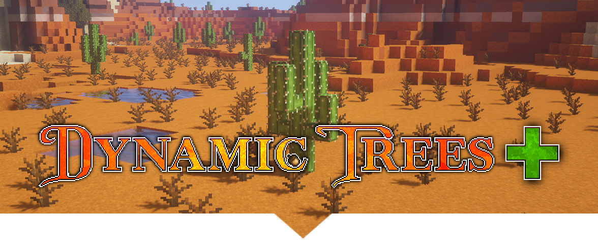

# Dynamic Trees + 

Official extension of [Dynamic Trees](https://github.com/ferreusveritas/DynamicTrees/); expands on the scope of DT by adding dynamic foliage that is not a tree.

This branch is for the 1.16.5 version of Minecraft.

### Links
- [Downloads](https://www.curseforge.com/minecraft/mc-mods/dynamictreesplus/files)
- [Discord](https://discord.gg/A4FCBS3)

### Compiling
* Clone the repository.
* Open a command prompt/terminal to the repository directory.
* Run `gradlew build` on Windows, or `./gradlew build` for MacOS or Linux.
* The built jar file will be in `build/libs/`.
